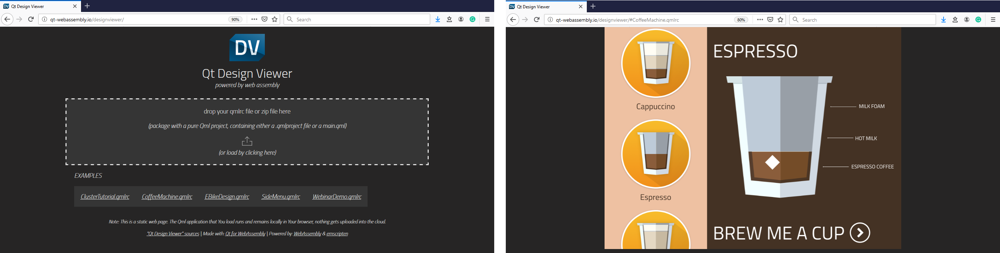

# Qt Design Viewer

## About
Launch [Design Studio](https://www.qt.io/ui-design-tools) projects in Your web browser. Or share Your design on the web. The viewer that helps you do this is done with [Qt for WebAssembly](https://doc.qt.io/qt-5/wasm.html). The underlying technologies are [WebAssembly](https://webassembly.org/) & [emscripten](https://emscripten.org/).

Qt Design Viewer works in a variety of web browsers which support WebAssembly, on Desktop and even on mobile.

## Usage
Compress Your Qml project as a _.zip_ file, ideally including a _.qmlproject_ file. Or use the _Build -> Generate Resource File_ feature of Qt Design Studio 1.3+ to pack Your project in a _.qmlrc_ file.

The Qt Design Viewer lets You drop the _.zip_/_.qmlrc_, or load it via a file selector.

You can also select one of the premade examples. If you host the Qt Design Viewer on Your web server, You can offer your own examples. Direct links to hosted examples can be sent like this:
* http://qt-webassembly.io/designviewer/#ClusterTutorial.qmlrc
* http://qt-webassembly.io/designviewer/#CoffeeMachine.qmlrc
* http://qt-webassembly.io/designviewer/#SideMenu.qmlrc

## Note
This is a static web page. The Qml application that You load runs and remains locally in Your browser, nothing gets uploaded into the cloud.

## Live version
Check out the [live version](https://qt-webassembly.io/designviewer/) of the Qt Design Viewer.
